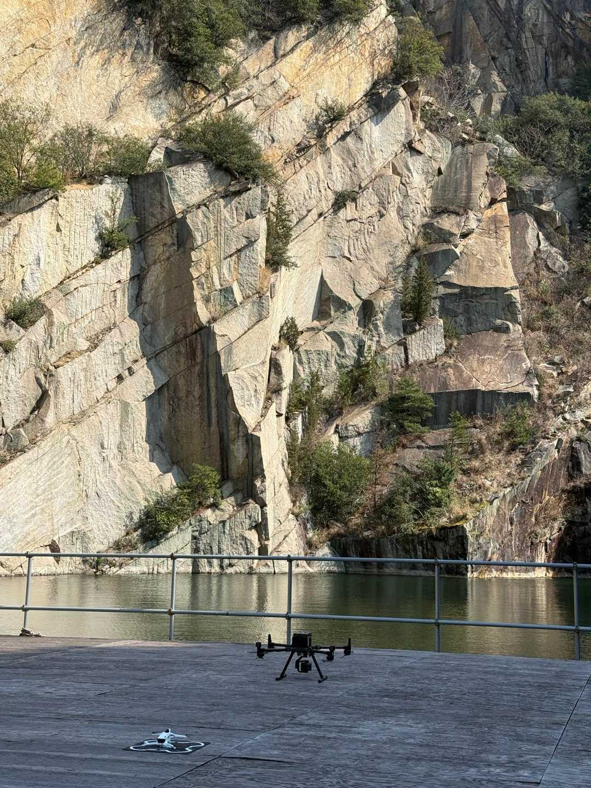
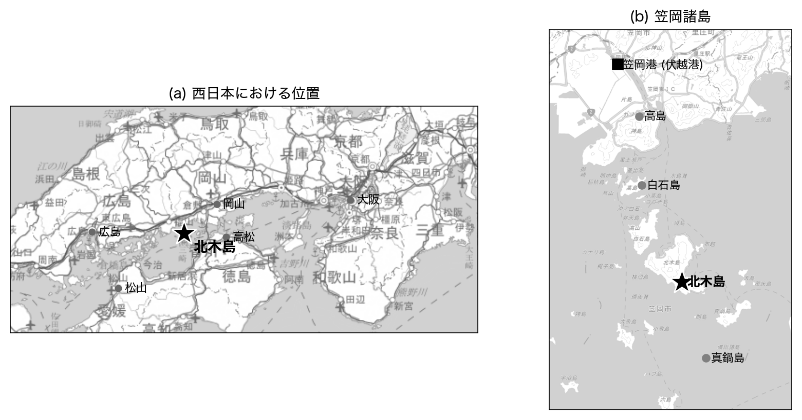
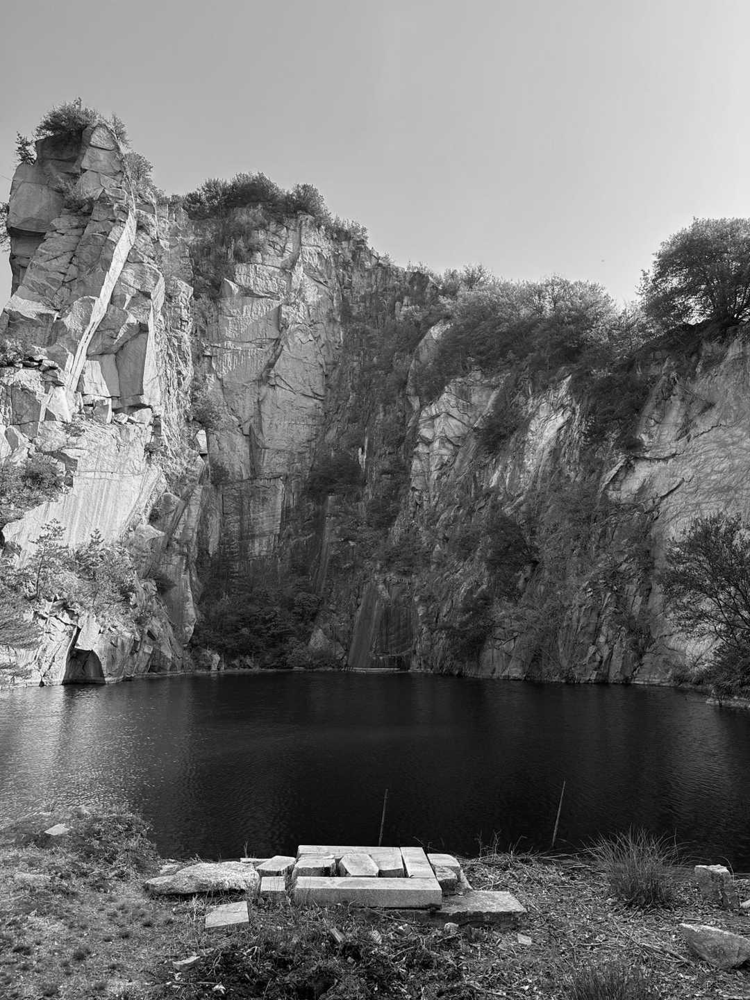
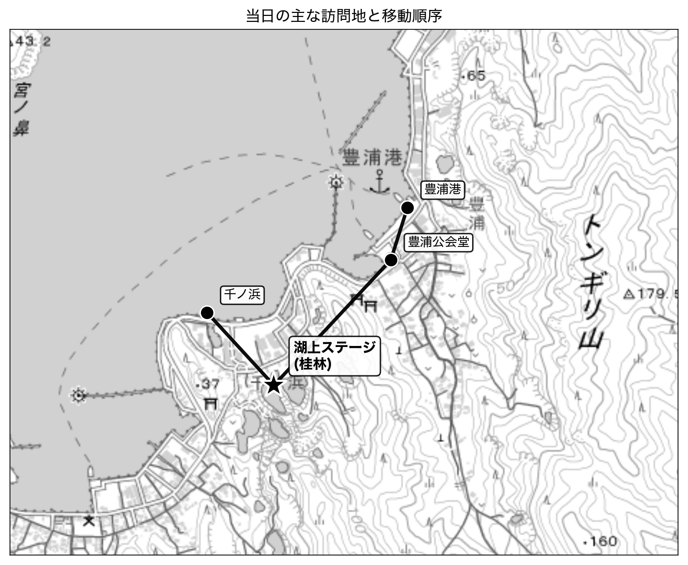
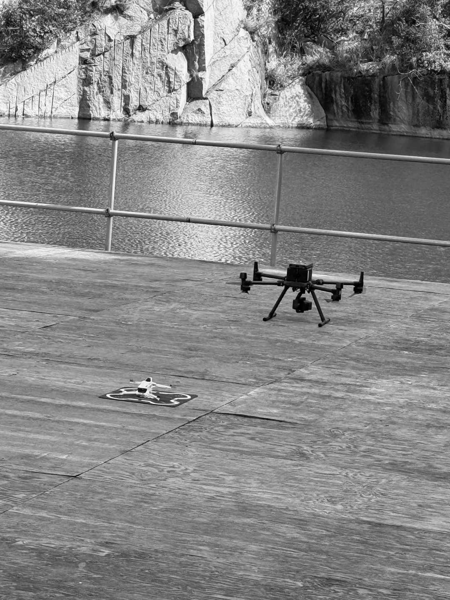
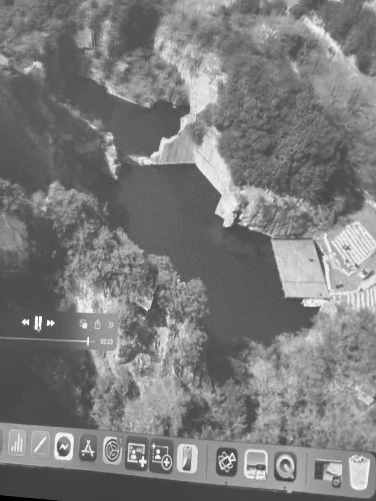
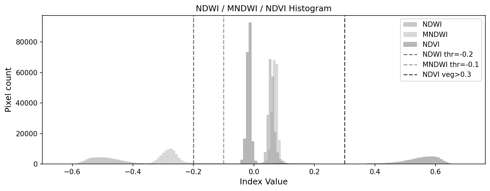
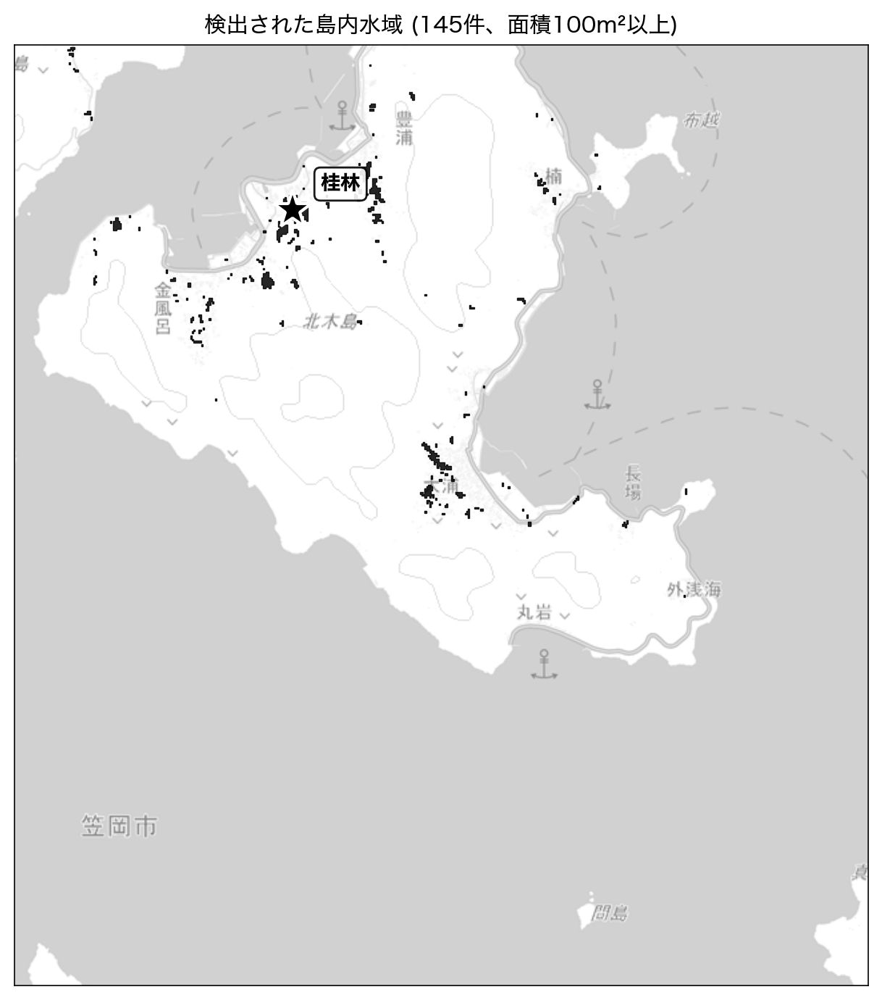
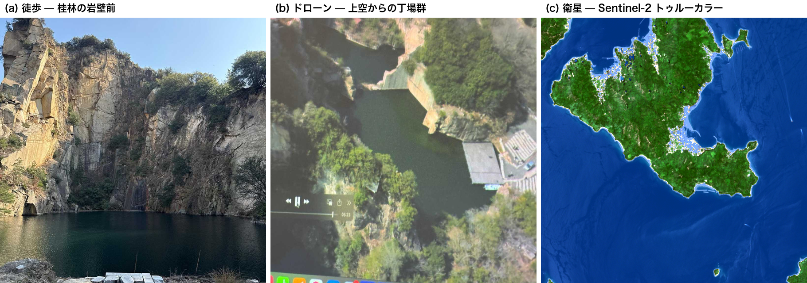

# 岡山県・北木島訪問記

―徒歩・ドローン・衛星から眺めた石と丁場の産業遺産―

大塚　昇

---

## 〔冒頭〕

岩壁が、垂直に立っている。表面はツルツルで、よく切れる包丁で羊羹をスパッと切ったような断面だ。底には濃い緑色の水面。覗き込んでも底が見えない。ここは岡山県笠岡諸島・北木島の旧丁場跡、通称「北木の桂林」である。山歩きが趣味なので、こういう壁を見るとつい登るルートを目で追ってしまうのだが、よく見るとそもそもこの壁は自然のものではない。人が石を切り出した跡地である。

北木島の存在は、訪問の少し前にX（旧Twitter）で偶然見かけた告知で知った。「北木島ドローン・マッピングパーティ 2026」（2026年3月20-21日）と題された一泊二日のイベントの告知である。OpenStreetMap（以下OSM）の地図に島内の地物を反映させていく作業と、ドローンによる景観確認とを二日にわたって行うワークショップだった。告知の写真に写っていた岩壁が、整いすぎていて見たことのない景観だった。これは実物を見ねばと思い、単独で島まで足を運んだ次第である。

訪問のあと、もうひとつ視点が加わった。帰りの新幹線で、衛星画像から水域を抽出する処理を使えば、島内の丁場跡の池をまとめて検出できるのでは、と気がついたのだ。降車前にざっと実装してみると、北木島の島内に145個もの水域が見えた。私が現地で歩いて目にした丁場は、せいぜい10個に満たない。

本稿は、この体験を時系列ではなく、見る縮尺に沿って三段に分けて記すものである。Ⅰ章は徒歩で岩壁の前に立った五感の記録、Ⅱ章はドローンの俯瞰、Ⅲ章は衛星から見た島全体の丁場分布である。同じ場所を、徒歩、ドローン、衛星と縮尺を引き上げていくと、それぞれ別のものが見えてくる。それが、現地から戻ったあとに気づいたことだった。

## Ⅰ　徒歩スケール — 桂林の岩壁の前で

### １．港から島内へ

笠岡駅から伏越港までは送迎の車で移動し、そこから島まではフェリーで渡る。曇り空だったが、寒くはない、過ごしやすい3月の朝だった。海はエメラルドグリーンで、笠岡諸島の島影が霞んで見える。乗船する人々の足取りは軽やかで、誰もが乗り慣れた様子だった。私のような一見の旅行者にはやや足取りが及ばない。

島の港に降り立つと、すぐに気がつくのは、街のあちこちに切り出された石材が使われていることである。家の塀、道路の縁石、護岸、墓石、ちょっとした段差。要するに、見渡す限りの構造物に石が組み込まれている。北木島の主要産業は花崗岩――いわゆる北木石――の採石業であり、元和6年（1620年）の大坂城再築に石材を供出した時期に遡るという^1)^。明治期以降に本格化した採石は、最盛期の昭和32年（1957年）には島内127か所の丁場が稼働し、人口は最大1万2千人に達した^2)^。現在は稼働丁場が2か所、人口は約600〜700人にまで縮んでいる。それでも、石は島の生活の中に変わらず溶け込んでいる。

港に降り立ったあと、まずは島内の集会所に集まってイベントの趣旨説明を受けた。それから車で「北木の桂林」へと向かう。10分ほどの道のりである。

### ２．桂林に立つ

そして冒頭の岩壁である。

「桂林」とは旧今岡石材の丁場跡を指す通称で、切り出された花崗岩の岩壁に囲まれた湖である。池というには大きすぎ、湖と呼ぶのが感覚に合う。岩肌はツルツルとしていて、節理ではなく、明らかに切削された跡が残る。直線と直角が支配する、人工の渓谷である。水面の色は深い緑で、湖は見るからに深い。

足元の石、見上げる岩壁、足の下の水面、すべてが同じ花崗岩なのだと考えると、少しおかしな感じがする。地殻深部から押し上げられて固結した岩体が、人の手で切り出され、運ばれ、加工され、再びこの島で石塀になり、墓石になり、そしてここでは凹んだ穴として残されている。

### ３．湖上ステージにて

桂林の湖には、ステージが設えられている。木製の小さなステージと、それに向かって並べられた、座席代わりの石である。ステージは水面の上に浮かんでいて、岸からはドラム缶を並べただけの即席の橋で渡る。歩くたびに揺れて、これがなかなか怖い。

桂林は時に湖上イベントの会場として使われるという。ステージに腰を下ろして眺めると、観客席に並ぶ石の背後に、岩壁が屏風のように立ち上がっている。岩壁を背景にした野外劇場、ということになる。

参加者の何人かは、ここで上空にドローンを上げ、空から見下ろした北木島の映像を覗き込んでいた。空から見る瀬戸内の海はきれいだ、と皆が口々に言っていた。同じ場所に立ったまま、視点だけが上空に移っていく。

## Ⅱ　ドローンスケール — 「肉眼で見えるもの」を超えて

### １．マッピングパーティという催し

ドローン・マッピングパーティ二日間の活動は、大きく二本立てだった。一つは、ドローンによる景観の上空確認である。北木島の景観資源は2019年に日本遺産「知ってる!? 悠久の時が流れる石の島」の構成文化財に登録されている^3)^が、その多くは島の山中、人の徒歩経路から外れた場所に点在している。徒歩では届かない丁場群を、ドローンを上げて空から確認する。もう一つは、OpenStreetMapへの地物反映作業である。こちらは島内の集会所で、参加者が手元の端末で地図を編集していく、いわばOSM編集ハンズオンである。前者は屋外、後者は屋内、双方ともに北木島の地理情報を充実させるための営みではあるが、両者は別系統の作業として並行して行われた。

実は同イベントは前年（2025年3月）にも一度開催されており、その時のレポートには「肉眼では把握不能な『丁場湖の全体景観』」「砕石事業者間の境界として残された、垂直の造形美」といった発見が報告されている^4)^。私自身、OSMで地物を追加した経験は以前にも一度あった。ただし、対象地域に集まって集中的に編集を進めるハンズオン形式に参加するのは初めてだった。

ハンズオンの講師の方は、OSMで地物を公開する作業を「世界デビュー」と呼んでいた。ローカルに留まっていたデータがWebの世界標準地図に乗ることで、それが世界中の地図ユーザーに「見える」ようになる、ということである。

### ２．上空から見える境界線

ドローンが離陸する瞬間を、桂林の湖上ステージで目撃した。プロペラ音は思ったより静かで、機体は気がつくとずいぶん高いところまで上がっている。操縦するスタッフは頭にヘッドセットディスプレイを装着しており、湖を上空から覗き込んだ画はその中に映し出されていた。

最初に「おっ」と思ったのは、山の中にぽつりと現れる丁場の、人工的な歪感だった。緑の樹冠の中に、明らかに直線で切り取られたグレーの矩形が浮かび上がる。自然界では、こういう輪郭は普通できない。

さらに目を引いたのは、丁場と丁場の境界に立つ細いリッジ状の岩壁である。隣り合う採石事業者が、それぞれの掘削可能な範囲ぎりぎりまで石を切り出した結果、ふたつの丁場のあいだに、薄い壁だけが取り残されている。企業同士を境目として岸壁を形成していることが上空からはよく分かる。これは自然では決して形成され得ない、産業由来の地形である。所有境界が、ほとんど直接的に地形になっているのである。

### ３．地形を作る主体としての採石業

地形は、自然営力――風化、侵食、堆積、地殻運動――の積分として理解されることが多い。だがこの島では、産業活動という、もう一段大きなタイムスケールの「地形を作る主体」が島の表面を彫り込んでいる。土地所有の境界線が、そのまま岩壁の位置を決めている。空から見るとそのことが、ほとんど図示されたかのように明白に見える。

その違和感が、北木島の景観資源としての面白さの中心にある、と私は思う。歩くだけでは、丁場と丁場のあいだの「境界としての壁」は単なる岩肌にしか見えない。空に上がって初めて、それが境界として立っていることが分かる。

イベント二日目には、島内の集会所でOSM編集のハンズオンが行われた。前日に街中で目に留めた地物――ベンチ、店舗、その他目立つ建物など――を、ひとつずつOSM上に追加していく。地味な作業だが、編集を保存して地図上に反映されるのを見ると、たしかにこれは「世界デビュー」と呼べる行為である。

## Ⅲ　衛星スケール — 145の池が島の何を語るのか

### １．思いつきと、新幹線での実装

帰りの新幹線で、衛星画像のことを思い出したのは、現地で見た丁場跡の水域そのものを、もっと広い範囲で確かめたかったからだった。ドローンや徒歩で目視できた丁場は数えるほどしかないが、衛星なら島全体を一度で撮影してくれる。私は別の業務で、Sentinel-2衛星の画像から水域を抽出する処理を扱った経験があり、これが丁場跡の池の検出にそのまま使えそうだ、と気がついた。

東京に戻ってから手を動かす予定だったが、新幹線の中で開発環境を整え、解析を回し始めてしまった。Microsoft Planetary Computer から Sentinel-2 L2A プロダクト（雲量0.7%、2025年8月撮影）を取得し、Green/NIR/SWIRバンドからNDWIとMNDWI、NDVIを計算する。水域指数の理屈は単純で、水は近赤外光を強く吸収する一方で可視光の緑を反射するため、(Green − NIR)/(Green + NIR) という割り算をすると水域だけ正の値になる^5)^。植生や裸地はこの値が負になる。NIR を SWIR に置き換えた MNDWI を併用すると、岩肌と水の分離がさらに改善することが知られている^6)^。

要するに、島を撮影した10mピクセルの衛星画像のうち、「水っぽいピクセル」だけを抜き出したい、というだけの話である。

### ２．145個の水域

最終的に、北木島の島内（海域を除く）から、面積100m²以上の水域ポリゴンが145件抽出された。これは、最盛期の昭和32年に127か所が稼働していた^2)^という丁場の数と、桁が一致する。もちろん、自然の池や貯水池が一部混じっている可能性はあるし、逆にスペクトル混合により小さな丁場が捕捉できていないものもあるはずだが、まあ、だいたいの数は合う。

分布を見ると、北部・南東部・中央部・西部の4つの集中地帯がある。最大水域は島北部の7,826m²で、これは桂林とは別の丁場（金風呂地区周辺）にあたる。桂林に相当する大型水域は、島南東部に確認できた。

### ３．歩いた丁場と、見ていない丁場

イベント中に徒歩や車で訪れた丁場は、実数えてみても、せいぜい5〜6か所ほどである。千ノ浜（島民から「北木島のベニス」とも呼ばれる、石材で護岸された海岸）も訪れたが、これは丁場ではない。要するに、私が現地で五感で確かめたのは、衛星から見える145件の水域のうちの、5%にも満たない。

徒歩・ドローン・衛星の三段の縮尺は、それぞれ撮影できる「面積」がまるで違う。徒歩で立てるのは丁場の前と、湖上ステージの上だけ。ドローンは半径数百mの空間を一気に俯瞰してくれる。衛星は島全体を一度で覆う。徒歩は質感を、ドローンは境界の在り方を、衛星は分布のパターンを、それぞれ可視化する。

もし訪問前に衛星解析の結果を先に見ていたら、現場で岩壁を見上げた感覚は持ち帰ってこなかったかもしれない。徒歩とドローンの体験だけで終わっていたら、丁場群の全容は見えないままだった。今回はこの順序で三つの縮尺が重なってくれた、というだけのことである。

## 〔結〕

北木島で気がついたのは、日本の各地には、産業によって作られた、自然とはまた別の美しい景観が確かに存在するということである。そしてそれは、誰の目にも開かれた状態にはなっていない場合が多い。歩いて辿りつけない場所、地図に記載されていない場所、あるいは記載されていても「ただの緑地」として塗られている場所がある。それらを探し出し、訪れて目で確かめ、何らかの形で記録する――それこそが紀行という営みの醍醐味なのだと、新幹線の中で衛星画像を見ながら思った。

夜の懇親会では、地元の方たちと牡蠣を食べながら話をした。次は山を歩いて、まだ見ていない丁場たちを間近で見たい、と伝えると、みなさん喜んでくれた。衛星に写っていた100以上の点には、それぞれ別の岩壁があり、別の水面があり、別の境界がある。次の訪問のときは、それらをひとつずつ歩いて確かめていきたいと思っている。

## 注

1) 北木石採石業の起源としての元和6年（1620年）大坂城再築への石材供出については、笠岡市ほか（2019）日本遺産「知ってる!? 悠久の時が流れる石の島」ストーリー本文を参照。https://japan-heritage.bunka.go.jp/ja/stories/story080/（2026年4月29日閲覧）。
2) 北木島の最盛期人口・丁場数および現在の人口については、NPO法人かさおか島づくり海社「北木島」紹介ページを参照。https://www.shimazukuri.org/笠岡諸島ってどんなとこ/北木島/（2026年4月29日閲覧）。
3) 文化庁（2019）「知ってる!? 悠久の時が流れる石の島」（日本遺産ストーリー番号080、認定日2019年5月20日）。
4) 同イベント前回開催（2025年3月1-2日）レポート「ウィキペディアタウンin日本遺産北木島」。https://openmatome.net/matome/view.php?q=17411452701803（2026年4月29日閲覧）。
5) 水域指数 NDWI の概念図および出典については、本文中で引用した McFeeters (1996) を参照。
6) MNDWI への拡張については本文中で引用した Xu (2006) を参照。SWIR帯を使うことで岩肌・建造物と水域の分離が改善する。
7) 衛星画像は Microsoft Planetary Computer 経由で取得した Sentinel-2 L2A プロダクト（©ESA）を使用した。

## 文献

- 笠岡市（1989）『笠岡市史 第2巻』，笠岡市．
- 笠岡市（2003）『笠岡市史 第3巻』，笠岡市．
- 乾睦子（2012）国内の花崗岩石材産業のあらましと現状—「稲田石」を例として—．『国士舘大学理工学部紀要』，**5**，74-80．
- 藪内芳彦（1971）島の地理学的研究．『人文地理』，**23**(2)，190-212．
- 劉逸飛・鹿嶋航・有田英樹・陸天来・石哲榜・王艺晴・王迪雅・川添航・松井圭介（2024）茨城県笠間における稲田石産業の変遷と生産流通構造に関する研究．『地域研究年報』，**46**，69-81．
- McFeeters, S. K. (1996) The use of the Normalized Difference Water Index (NDWI) in the delineation of open water features. *International Journal of Remote Sensing*, **17**(7), 1425-1432.
- Xu, H. (2006) Modification of normalised difference water index (NDWI) to enhance open water features in remotely sensed imagery. *International Journal of Remote Sensing*, **27**(14), 3025-3033.
