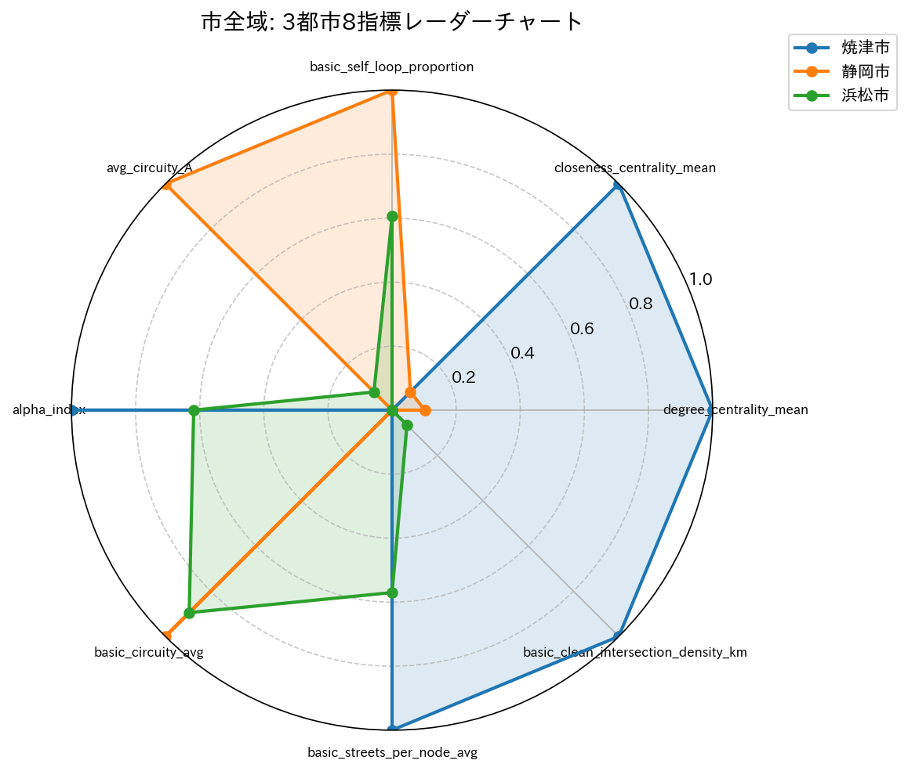
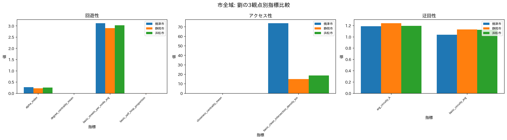
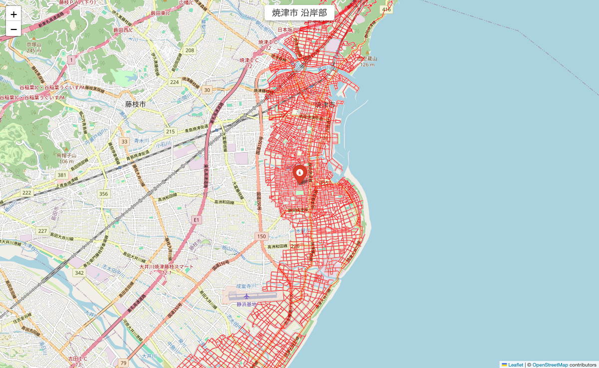
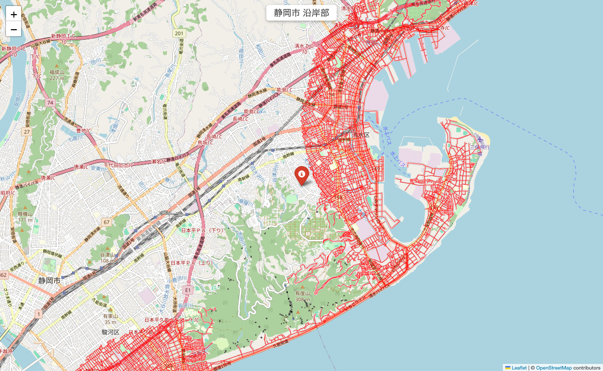
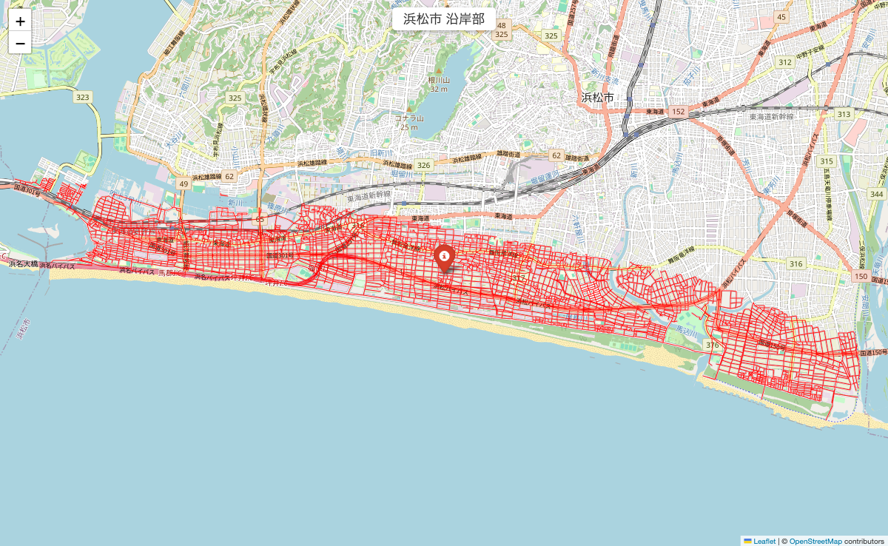
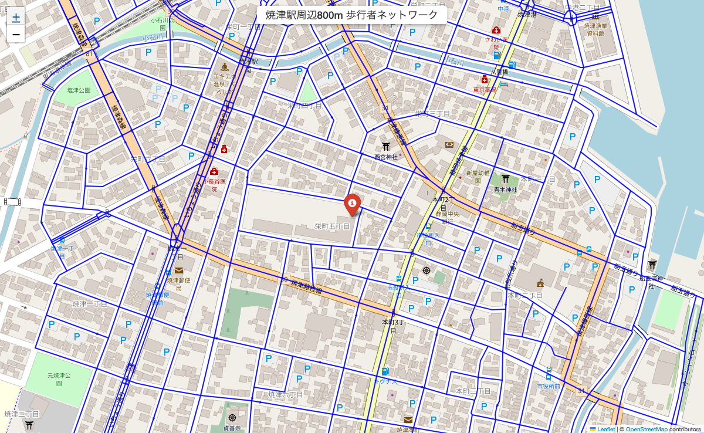
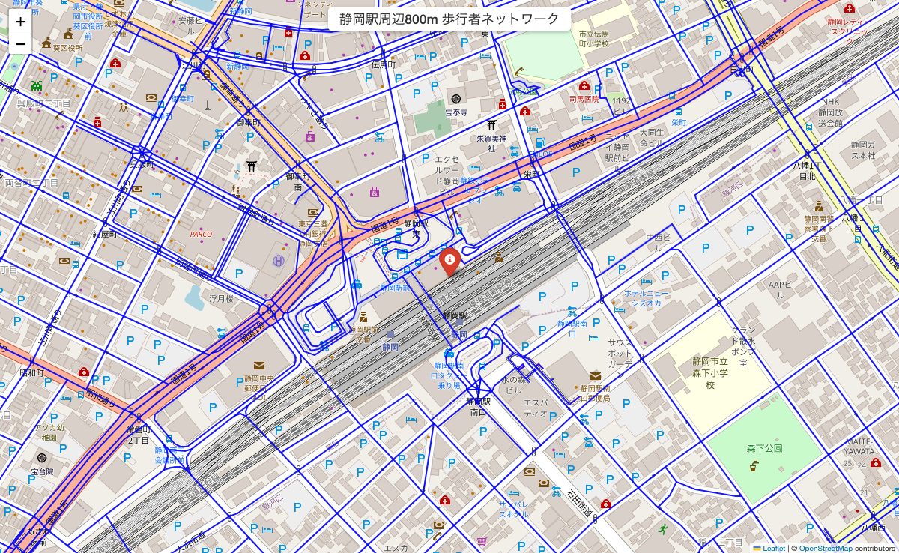
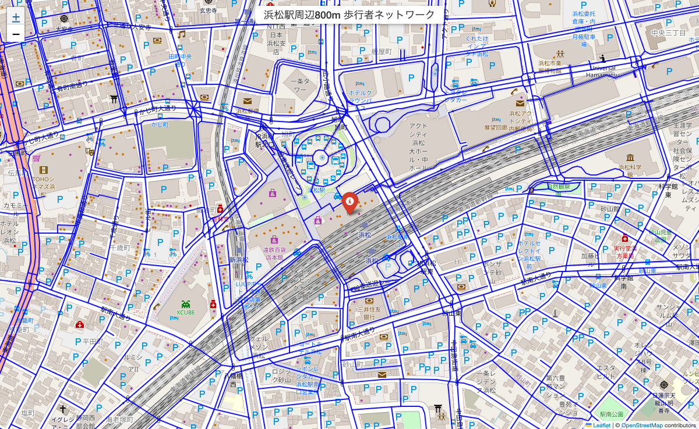
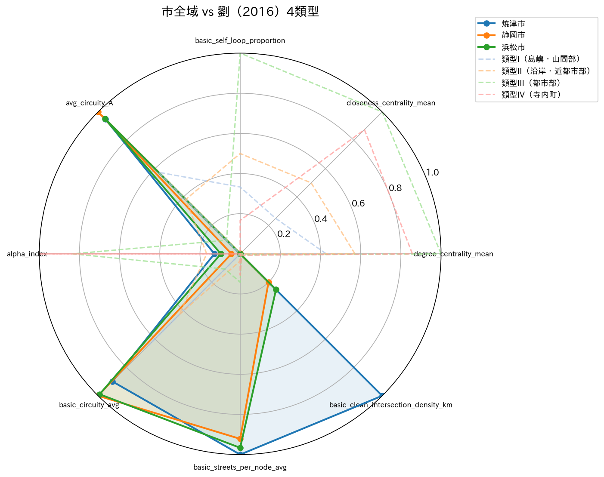
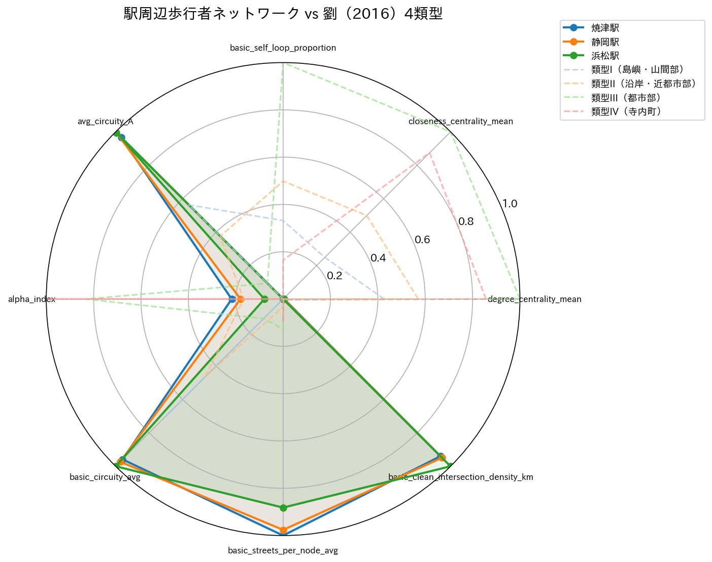

# 静岡県3都市の道路ネットワーク比較分析

実験ID: exp001
作成日: 2026-03-02
ステータス: 実験完了

---

## 1. はじめに

### 1.1 背景

都市の道路ネットワークは、人や物資の移動を支える社会基盤であると同時に、都市の空間構造を規定する基本的な骨格である。道路ネットワークの構造的特性は、日常の交通利便性のみならず、災害時の避難行動や観光地としての歩行回遊性にも深く関わる。

道路ネットワーク分析の応用先として、防災と観光の2分野が特に注目される。防災の観点では、津波・地震時の避難経路の冗長性や迅速性がネットワーク指標として捉えられる。沿岸部の道路構造が避難行動に及ぼす影響は、東日本大震災以降、実践的な課題として認識されている。一方、観光の観点では、歩行者の回遊行動を促す街路構造の理解が、まちなか観光の振興に不可欠である。駅を起点とした歩行圏の回遊性は、都市の観光ポテンシャルを測る指標の一つとなりうる。

### 1.2 研究目的

静岡県は駿河湾に面した沿岸平野部から南アルプスに連なる山岳地帯まで多様な地形を有し、県内各都市の道路ネットワークは地形条件と歴史的発展の経緯に応じた固有の構造を持つと考えられる。しかし、県内都市間の道路ネットワーク特性の定量的比較は、これまで十分に行われていない。

本研究では、防災と観光の2つの応用的観点を統合し、焼津市・静岡市・浜松市の3都市を対象として道路ネットワーク特性の多面的な比較分析を行う。具体的には、(1) 市全域、(2) 沿岸部と内陸部の対比（防災の観点）、(3) 主要駅周辺の歩行者ネットワーク（観光の観点）の3つのレベルで定量的に比較する。加えて、drive ネットワーク（自動車走行可能道路）と walk ネットワーク（歩行者通行可能道路を含む）の差異から、細街路がネットワーク構造に及ぼす効果を定量化する。

### 1.3 仮説

本研究では以下の4つの仮説を設定する。

**仮説1: 沿岸部の道路ネットワークは内陸部と比べて回遊性が低く迂回性が高い**

劉（2016）は沿岸・島嶼部の歴史的地区（類型II）において、主要道路の回遊性が低く道路網が粗であることを示した。本研究対象の3都市においても、海岸線から2km以内の沿岸部では内陸部と比較して alpha_index が低く（循環路が少なく）、avg_circuity_A が高い（迂回が大きい）と予測する。この傾向は防災上、津波避難時の代替経路の少なさと避難距離の増大を意味する。

**仮説2: 都市規模が異なる3市の駅前地区の回遊性に差異がある**

劉の類型IIIに示されるように、都市部の格子型道路網は高い回遊性を有するが、その程度は都市の発展段階や歴史的成り立ちにより異なる。政令指定都市の浜松駅、県庁所在地の静岡駅、地方都市の焼津駅の周辺800m圏における歩行者ネットワークの回遊性指標（alpha_index, degree_centrality_mean）に統計的に意味のある差が観察されると予測する。

**仮説3: 細街路の回遊性への寄与度は都市の性格により異なる**

劉（2016）の知見では、島嶼・山間部集落（類型I）や寺内町（類型IV）では細街路が回遊性向上に大きく寄与する一方、都市部地区（類型III）では細街路は袋路（行き止まり）が多く回遊性に寄与しにくい。本研究では、漁港町の焼津駅周辺では walk ネットワークの alpha_index が drive 比で大きく上昇し、都市部の静岡駅・浜松駅周辺では上昇幅が小さいと予測する。

**仮説4: 8指標による多面的評価により都市固有のネットワーク特性を識別できる**

回遊性・アクセス性・迂回性の3観点に対応する8指標を統合的に用いることで、単一指標では捉えられない各都市固有のネットワーク特性パターンを識別できると予測する。この多面的評価は、劉の4類型との照合による位置づけを可能にする。

## 2. 先行研究と本研究の位置づけ

### 2.1 グラフ理論による道路ネットワーク分析

グラフ理論を用いた道路ネットワークの定量分析は、Porta, Crucitti and Latora (2006) による都市街路のネットワーク解析手法の提案以降、都市計画・交通工学・地理学の分野横断的な研究テーマとして発展してきた。近年では Boeing (2017) が開発した OSMnx により、OpenStreetMap のデータを直接グラフとして取得・分析できるようになり、大規模な都市間比較や地区間比較が容易になった。

### 2.2 劉の3観点・4類型

日本の都市を対象とした先駆的研究として、劉（2016）は全国16の歴史的地区を対象に、回遊性・アクセス性・迂回性の3観点からネットワーク特性を定量化し、4つの類型を導出した。この類型化は、地区の地理的立地（島嶼・沿岸・都市内部）と歴史的成り立ちが道路構造に反映されることを明らかにしたものである。

| 類型 | 特徴 | 本研究との対応可能性 |
|------|------|-------------------|
| 類型I（島嶼・山間部集落） | 主要道路の回遊性低、細街路が回遊性向上に大きく寄与 | 3市の中山間部 |
| 類型II（沿岸・島嶼近都市部） | 類型Iに類似、道路網が比較的粗 | 焼津沿岸部、各市沿岸部 |
| 類型III（都市部地区） | 格子型道路網、回遊性・アクセス性が高い、細街路は袋路状 | 静岡駅・浜松駅周辺 |
| 類型IV（寺内町） | 碁盤目状町割、細街路が南北を貫通し回遊性に貢献 | （該当なし、参照枠として使用） |

### 2.3 本研究の位置づけ

劉（2016）の分析対象は歴史的地区（面積・範囲が比較的小さい）であり、現代都市の市域全体や機能的サブエリア（沿岸部・駅周辺）への適用は試みられていない。また、劉は細街路の寄与が地区の類型により大きく異なることを示したが、その知見が現代都市においても成立するかは未検証である。

本研究は、Boeing (2017) の OSMnx と劉 (2016) の3観点・4類型を組み合わせ、防災（津波避難）と観光（歩行回遊）という2つの応用的観点から静岡県3都市の道路ネットワークを多層的に比較する。劉の理論的枠組みを現代都市の広域分析に適用し、その一般性と限界を検証することが本研究の学術的位置づけである。

## 3. 研究方法

### 3.1 対象地域

本研究が取り上げる3都市は、それぞれ異なる都市特性を有する。

- **焼津市**: 駿河湾に面した漁港都市。南海トラフ地震による津波リスクが高く、沿岸部の避難路網の構造的把握が急務である。旧来の漁村集落に由来する細街路が市街地に残存しており、劉（2016）の類型IIに該当する可能性がある。
- **静岡市**: 県庁所在地であり、駿府城の城下町を起源とする格子状市街地を中心部に有する。劉の類型IIIに近い都市部の道路構造が想定されるが、沿岸部から山間部まで広い市域を持つため、エリアによる構造差も大きいと考えられる。
- **浜松市**: 政令指定都市であり、遠州灘に面した工業都市。都心部は近代的な格子状街路を基盤とする一方、広大な中山間地域を含む。

### 3.2 データ取得

OpenStreetMap のデータを OSMnx (Boeing, 2017) を用いて取得した。取得対象は以下のとおりである。

| 分析レベル | 対象エリア | network_type | 取得方法 |
|-----------|-----------|-------------|---------|
| 市全域 | 焼津市・静岡市・浜松市 | drive | `ox.graph_from_place()` |
| 沿岸部/内陸部 | 各市の海岸線2km以内/超 | drive | サブグラフ抽出 |
| 駅周辺 | 焼津駅・静岡駅・浜松駅 | walk, drive | `ox.graph_from_point()` 800m |

海岸線データは `ox.features_from_place()` の `natural=coastline` タグで取得し、各ノードから海岸線までの最近接距離を算出して沿岸部（2km以内）と内陸部（2km超）に分類した。

駅周辺分析には以下の座標を使用した。

| 駅名 | 緯度 | 経度 |
|------|------|------|
| 焼津駅 | 34.8671 | 138.3225 |
| 静岡駅 | 34.9717 | 138.3891 |
| 浜松駅 | 34.7038 | 137.7350 |

800m は徒歩約10分の距離に相当し、駅を起点とした歩行観光の基本圏域として設定した。

### 3.3 分析指標

分析に用いる8指標を劉（2016）の3観点で構造化した。

**回遊性（4指標）**

- **alpha_index**: 独立ループ数の最大可能ループ数に対する比率。(e - n + p) / (2n - 5) で算出する。値が高いほど循環路が多く、回遊性に富む。劉（2016）のα指標に相当する。
- **degree_centrality_mean**: 各ノードの次数中心性（接続エッジ数 / 最大可能接続数）の平均値。交差点の接続性を全体的に評価する。
- **basic_streets_per_node_avg**: ノードあたりの平均接続街路数。分岐の多さを直接的に表す。
- **basic_self_loop_proportion**: 自己ループ辺（始点と終点が同一ノード）の全辺に対する比率。ロータリー・周回道路等の計画的循環路の存在を示す。

**アクセス性（2指標）**

- **closeness_centrality_mean**: 各ノードの近接中心性の平均値。ネットワーク全体における到達性の良さを表す。
- **basic_clean_intersection_density_km**: km²あたりの交差点密度（行き止まりノードを除く）。道路網の目の細かさを評価する。

**迂回性（2指標）**

- **avg_circuity_A**: ランダムなODペア間のダイクストラ最短経路距離とユークリッド距離の比率の平均。劉（2016）の迂回率Aに相当する。1.0 に近いほど直線的な経路が確保されていることを意味する。
- **basic_circuity_avg**: OSMnx の `basic_stats` で算出される平均迂回率。全エッジの道路距離と両端点間直線距離の比率の加重平均。

### 3.4 分析の3レベル

分析は以下の3レベルで段階的に行い、マクロからミクロへの多層的な理解を目指した。

1. **市全域比較**: 3市の drive ネットワーク全体を比較し、都市規模・地形条件による構造差の全体像を把握する。
2. **沿岸部/内陸部比較（防災）**: 各市内の沿岸部と内陸部を対比し、沿岸立地が道路構造に及ぼす影響を防災の観点から評価する。劉の類型IIの知見との照合を行う。
3. **駅周辺比較（観光）**: 3駅周辺の歩行者ネットワークを比較し、各駅前地区の回遊性を観光の観点から評価する。drive/walk の差異から細街路効果を定量化する。

## 4. 結果

### 4.1 市全域比較

**回遊性指標**

| 指標 | 焼津市 | 静岡市 | 浜松市 |
|------|--------|--------|--------|
| alpha_index | 0.277 | 0.226 | 0.258 |
| degree_centrality_mean | 3.79×10⁻⁴ | 9.63×10⁻⁵ | 6.43×10⁻⁵ |
| basic_streets_per_node_avg | 3.125 | 2.904 | 3.030 |
| basic_self_loop_proportion | 1.57×10⁻⁴ | 8.22×10⁻⁴ | 5.60×10⁻⁴ |

焼津市が alpha_index（0.277）および basic_streets_per_node_avg（3.125）で3市中最高値を示し、回遊性が最も高いことが確認された。静岡市は alpha_index が0.226と最も低く、市域全体でみた循環路の形成が相対的に少ない。浜松市は中間に位置する（0.258）。self_loop_proportion は静岡市が最高（8.22×10⁻⁴）であり、ロータリーや周回道路等の計画的循環路が相対的に多いことを示す。

**アクセス性指標**

| 指標 | 焼津市 | 静岡市 | 浜松市 |
|------|--------|--------|--------|
| closeness_centrality_mean | 2.09×10⁻⁴ | 9.19×10⁻⁵ | 8.16×10⁻⁵ |
| basic_clean_intersection_density_km | 73.97 | 14.93 | 18.81 |

焼津市の交差点密度（73.97 /km²）は静岡市（14.93）・浜松市（18.81）の約4〜5倍であり、コンパクトな市域に密な道路網が形成されていることを示す。近接中心性も焼津市が最高値（2.09×10⁻⁴）を示し、ネットワーク全体における到達性の良さが確認された。

**迂回性指標**

| 指標 | 焼津市 | 静岡市 | 浜松市 |
|------|--------|--------|--------|
| avg_circuity_A | 1.190 | 1.244 | 1.194 |
| basic_circuity_avg | 1.040 | 1.134 | 1.124 |

静岡市の avg_circuity_A（1.244）が3市中最も高く、OD ペア間の最短経路が直線距離の約1.24倍に達する。これは市域に広がる中山間地域の影響と考えられる。焼津市（1.190）と浜松市（1.194）は同程度であり、比較的直線的な経路が確保されている。basic_circuity_avg でも同傾向が確認され、静岡市（1.134）が最も高い。

**レーダーチャートと棒グラフ**

以下のレーダーチャートは、3市の8指標を正規化（0〜1）し、劉の3観点（回遊性・アクセス性・迂回性）ごとにプロットしたものである。焼津市が回遊性・アクセス性で突出し、迂回性が低い（直線的）パターンを示す一方、静岡市は迂回性が高く回遊性・アクセス性が低いパターンを示す。

### 4.2 沿岸部/内陸部比較

**回遊性指標**

| 指標 | 焼津市 沿岸/内陸 | 静岡市 沿岸/内陸 | 浜松市 沿岸/内陸 |
|------|----------------|----------------|----------------|
| alpha_index | 0.286 / 0.244 | 0.240 / 0.214 | 0.270 / 0.254 |
| degree_centrality_mean | 6.79×10⁻⁴ / 8.33×10⁻⁴ | 3.12×10⁻⁴ / 1.38×10⁻⁴ | 6.21×10⁻⁴ / 7.15×10⁻⁵ |
| basic_streets_per_node_avg | 3.175 / 3.061 | 2.986 / 2.867 | 3.112 / 3.021 |
| basic_self_loop_proportion | 2.76×10⁻⁴ / 0.000 | 5.72×10⁻⁴ / 9.49×10⁻⁴ | 1.31×10⁻⁴ / 6.13×10⁻⁴ |

3市すべてにおいて、沿岸部の alpha_index が内陸部を上回った（焼津市 +0.042、静岡市 +0.026、浜松市 +0.016）。basic_streets_per_node_avg でも同様に沿岸部が内陸部を上回っており、沿岸部の道路網は内陸部よりも循環路が多く分岐も多い構造であることが確認された。

**アクセス性指標**

| 指標 | 焼津市 沿岸/内陸 | 静岡市 沿岸/内陸 | 浜松市 沿岸/内陸 |
|------|----------------|----------------|----------------|
| closeness_centrality_mean | 2.24×10⁻⁴ / 2.36×10⁻⁴ | 8.76×10⁻⁵ / 1.24×10⁻⁴ | 2.10×10⁻⁴ / 8.10×10⁻⁵ |
| basic_clean_intersection_density_km | 67.86 / 50.52 | 31.70 / 11.05 | 81.26 / 17.55 |

交差点密度は3市すべてで沿岸部が内陸部を大きく上回った。特に浜松市では沿岸部（81.26 /km²）が内陸部（17.55）の約4.6倍に達し、沿岸平野部に集約的な市街地が形成されていることを示す。静岡市でも沿岸部（31.70）が内陸部（11.05）の約2.9倍であった。

**迂回性指標**

| 指標 | 焼津市 沿岸/内陸 | 静岡市 沿岸/内陸 | 浜松市 沿岸/内陸 |
|------|----------------|----------------|----------------|
| avg_circuity_A | 1.199 / 1.217 | 1.306 / 1.289 | 1.118 / 1.188 |
| basic_circuity_avg | 1.039 / 1.041 | 1.068 / 1.159 | 1.017 / 1.134 |

迂回性については都市により異なるパターンが観察された。焼津市と浜松市では沿岸部の迂回性が内陸部より低く（焼津市: 1.199 < 1.217、浜松市: 1.118 < 1.188）、沿岸平野部の直線的な道路配置を反映する。一方、静岡市では沿岸部の迂回性が内陸部よりわずかに高い（1.306 > 1.289）。これは日本平・有度山等の丘陵地が沿岸部に位置し、地形的制約が道路の迂回を生じさせている可能性を示唆する。

**沿岸部の道路ネットワーク地図**

### 4.3 駅周辺比較

**walk ネットワーク: 回遊性指標**

| 指標 | 焼津駅 | 静岡駅 | 浜松駅 |
|------|--------|--------|--------|
| alpha_index | 0.330 | 0.308 | 0.247 |
| degree_centrality_mean | 5.04×10⁻³ | 3.61×10⁻³ | 1.80×10⁻³ |
| basic_streets_per_node_avg | 3.438 | 3.362 | 3.067 |
| basic_self_loop_proportion | 9.18×10⁻⁴ | 6.94×10⁻⁴ | 8.05×10⁻⁴ |

焼津駅周辺の walk ネットワークが3駅中最も高い回遊性を示した。alpha_index は焼津駅（0.330）> 静岡駅（0.308）> 浜松駅（0.247）の順であり、焼津駅と浜松駅の間には0.083の差がある。basic_streets_per_node_avg でも焼津駅（3.438）が最高であり、ノードあたりの接続街路数が多い密な分岐構造を有する。

**walk ネットワーク: アクセス性指標**

| 指標 | 焼津駅 | 静岡駅 | 浜松駅 |
|------|--------|--------|--------|
| closeness_centrality_mean | 1.18×10⁻³ | 1.04×10⁻³ | 9.98×10⁻⁴ |
| basic_clean_intersection_density_km | 183.3 | 185.2 | 195.1 |

アクセス性指標では興味深い対比が見られた。近接中心性は焼津駅（1.18×10⁻³）> 静岡駅（1.04×10⁻³）> 浜松駅（9.98×10⁻⁴）の順であるが、交差点密度は浜松駅（195.1 /km²）> 静岡駅（185.2）> 焼津駅（183.3）の逆順であった。浜松駅周辺は交差点は密であるがノード数も多いため、ネットワーク全体での到達性（近接中心性）はやや低下する。

**walk ネットワーク: 迂回性指標**

| 指標 | 焼津駅 | 静岡駅 | 浜松駅 |
|------|--------|--------|--------|
| avg_circuity_A | 1.230 | 1.265 | 1.261 |
| basic_circuity_avg | 1.023 | 1.035 | 1.058 |

迂回性は焼津駅周辺が最も低く（avg_circuity_A = 1.230）、静岡駅（1.265）と浜松駅（1.261）はほぼ同水準であった。basic_circuity_avg では焼津駅（1.023）が顕著に低く、個別エッジレベルでも直線的な道路が多いことを示す。

**drive ネットワーク（参考）**

| 指標 | 焼津駅 | 静岡駅 | 浜松駅 |
|------|--------|--------|--------|
| alpha_index | 0.318 | 0.313 | 0.276 |
| degree_centrality_mean | 6.75×10⁻³ | 5.58×10⁻³ | 4.53×10⁻³ |
| basic_streets_per_node_avg | 3.411 | 3.423 | 3.235 |
| closeness_centrality_mean | 1.12×10⁻³ | 9.76×10⁻⁴ | 1.04×10⁻³ |
| basic_clean_intersection_density_km | 181.2 | 178.8 | 192.8 |
| avg_circuity_A | 1.287 | 1.250 | 1.218 |
| basic_circuity_avg | 1.024 | 1.012 | 1.018 |

**細街路効果（walk - drive の差分）**

| 指標 | 焼津駅 (walk-drive) | 静岡駅 (walk-drive) | 浜松駅 (walk-drive) |
|------|---------------------|---------------------|---------------------|
| alpha_index 差分 | **+0.013** | -0.005 | **-0.029** |
| degree_centrality_mean 差分 | -1.71×10⁻³ | -1.97×10⁻³ | -2.73×10⁻³ |
| basic_streets_per_node_avg 差分 | +0.027 | -0.060 | -0.168 |
| closeness_centrality_mean 差分 | +6.73×10⁻⁵ | +6.38×10⁻⁵ | -4.30×10⁻⁵ |
| basic_clean_intersection_density_km 差分 | +2.14 | +6.40 | +2.29 |
| avg_circuity_A 差分 | -0.057 | +0.015 | +0.043 |

焼津駅は alpha_index の差分が **+0.013** と3駅で唯一のプラス値を示し、歩行者専用道路・路地等の細街路が循環路を形成して回遊性を向上させていることが確認された。一方、浜松駅は **-0.029** と最も大きなマイナスを示し、細街路の追加がむしろ行き止まり（袋路）を増やして回遊性を低下させている。静岡駅は -0.005 とほぼ中立であった。

**駅周辺の歩行者ネットワーク地図**

## 5. 考察

### 5.1 市全域比較に関する考察

**都市規模と回遊性の関係**

劉（2016）の類型IIIが示すように、大規模都市の都心部では格子型道路網が発達し高い回遊性が期待されるが、市域全体でみた結果は必ずしもこの予想に合致しなかった。alpha_index は焼津市（0.277）> 浜松市（0.258）> 静岡市（0.226）の順であり、最もコンパクトな焼津市が最高値を示した。これは、静岡市・浜松市の市域に広大な中山間地域が含まれ、山間部の樹枝状道路網（分岐が少なく循環路に乏しい構造）が市域全体の平均値を引き下げているためと解釈できる。degree_centrality_mean でも同様に焼津市（3.79×10⁻⁴）が静岡市（9.63×10⁻⁵）・浜松市（6.43×10⁻⁵）を大きく上回っており、ノード数が少ないコンパクトな市域では各ノードの相対的な接続性が高くなるというスケール効果も寄与している。

このことは、市域全体の回遊性指標の解釈において、都市規模（人口や都心部の発達度）よりも市域の地理的範囲と地形条件が支配的であることを示唆する。回遊性の都市間比較には、同程度のスケールのエリア（例えば駅周辺圏）での比較が不可欠である（4.3節の結果を参照）。

**地形条件とアクセス性**

アクセス性指標において焼津市の突出が顕著であった。交差点密度（basic_clean_intersection_density_km）は焼津市が73.97 /km²であり、静岡市（14.93）の約5.0倍、浜松市（18.81）の約3.9倍に達する。これは焼津市の市域面積が約70 km²とコンパクトであり、市域の大部分が沿岸平野部の市街地で占められていることを反映する。一方、静岡市（約1,412 km²）・浜松市（約1,558 km²）は南アルプスや天竜川上流域等の広大な中山間地域を含み、道路網の密度が市域面積に対して希薄化する。

近接中心性でも焼津市が最高値を示したことから、コンパクトな市域では各ノードからネットワーク全体への到達性が高く、アクセス性の面で優位であることが確認された。ただし、この結果は市域の範囲設定に強く依存するため、絶対値の比較よりも沿岸部/内陸部の対比や同一スケールの駅周辺比較による相対的な評価がより有意義である。

**沿岸都市としての迂回性**

迂回性指標では静岡市が3市中最も高い値を示した（avg_circuity_A = 1.244、basic_circuity_avg = 1.134）。静岡市の市域は日本平や有度山等の丘陵地が清水区と駿河区の間に位置し、沿岸部であっても地形的制約を受けた道路配置が迂回性を高めていると考えられる。焼津市（1.190）と浜松市（1.194）はほぼ同程度の迂回性を示しており、比較的平坦な地形条件が直線的な道路配置を可能にしていることを示唆する。

### 5.2 仮説1の検証: 沿岸部と内陸部の比較

**結果: 棄却**

仮説1は「沿岸部の道路ネットワークは内陸部と比べて回遊性が低く迂回性が高い」と予測したが、実験結果はこれを棄却する。3市すべてにおいて、沿岸部の alpha_index は内陸部を上回り（焼津市 0.286 > 0.244、静岡市 0.240 > 0.214、浜松市 0.270 > 0.254）、沿岸部の回遊性が内陸部より高いという逆の結果が得られた。迂回性についても、静岡市を除く2市で沿岸部が内陸部より低い値を示し、仮説とは逆の傾向であった。

この結果は、劉（2016）が歴史的地区単位で観察した類型II（沿岸・島嶼近都市部）の特性——主要道路の回遊性が低く道路網が粗——が、同一市内の沿岸部/内陸部の対比には直接適用できないことを示す。劉の分析対象はそれぞれ固有の歴史的成り立ちを持つ地区であったのに対し、本分析は海岸線からの距離のみで機械的にエリアを分割している。この対象範囲の違いが結果の相違の主因と考えられる。

**沿岸部の回遊性が高い理由**

3市において沿岸部の回遊性が内陸部を上回る理由として、以下の2点が考えられる。

第一に、沿岸平野部への市街地の集中である。静岡県の3市はいずれも沿岸平野部に主要市街地が発達し、市街地化に伴う格子型・グリッド型の道路整備が進んでいる。沿岸部の交差点密度が内陸部を大きく上回る結果（浜松市で4.6倍）は、沿岸平野部の市街地密度の高さを裏付ける。市街地の道路網は循環路を多く含み、これが alpha_index の上昇に寄与している。

第二に、内陸部の中山間地域の影響である。静岡市・浜松市は市域の大部分を中山間地域が占め、山間部の道路は谷筋に沿った樹枝状構造となる。樹枝状道路網は循環路がほとんどなく alpha_index が低くなるため、内陸部全体の平均値を強く引き下げる。焼津市でも内陸部は高草山等の丘陵地を含み、同様の効果が生じている。

**静岡市沿岸部の高迂回性と防災上の含意**

3市の中で唯一、静岡市の沿岸部は内陸部より高い迂回性を示した（avg_circuity_A: 沿岸 1.306 > 内陸 1.289）。この値は3市の沿岸部の中でも突出しており（焼津市 1.199、浜松市 1.118）、静岡市沿岸部では最短経路が直線距離の約1.31倍に達することを意味する。

この高迂回性の要因として、清水区と駿河区の間に位置する日本平・有度山の丘陵地が挙げられる。沿岸部地図からも、丘陵地を挟んで道路ネットワークが南北に分断されている様子が読み取れる。防災の観点では、津波発生時に内陸方向への避難経路が丘陵地により制約され、避難距離が直線距離の1.3倍以上に延伸する可能性がある。

一方、焼津市沿岸部は3市の中で最も高い回遊性（alpha_index 0.286）と比較的低い迂回性（1.199）を有する。南海トラフ地震の津波リスクが高い焼津市において、沿岸部の道路網が一定の冗長性と直線的な避難経路を備えていることは、避難行動の観点からは肯定的な知見である。ただし、沿岸平野部の標高が低いため、ネットワーク構造の冗長性のみでは避難の安全性を評価できない点に留意が必要である。

浜松市沿岸部は最も低い迂回性（1.118）を示し、遠州灘に沿った平坦な地形条件が直線的な道路配置を可能にしていることが確認された。交差点密度も3市の沿岸部で最高（81.26 /km²）であり、避難経路の選択肢が多い構造となっている。

### 5.3 仮説2・3の検証: 駅周辺の回遊性と細街路効果

**仮説2の検証: 支持（ただし都市規模との順序は逆）**

仮説2は「都市規模が異なる3市の駅前地区の回遊性に差異がある」と予測した。結果は、3駅間に明確な回遊性の差が観察され、仮説2は支持された。ただし、回遊性の順序は焼津駅（0.330）> 静岡駅（0.308）> 浜松駅（0.247）であり、都市規模が大きいほど回遊性が高いという単純な関係は成立しなかった。

浜松駅周辺の alpha_index（0.247）は焼津駅（0.330）と比較して顕著に低い。浜松駅周辺は近代的な格子状街路を基盤としているが、街区スケールが大きく（交差点密度は最高ながら basic_streets_per_node_avg は最低の3.067）、大街区による循環路の少なさが alpha_index を低下させている。一方、焼津駅周辺は旧来の漁村集落に由来する小街区・密な分岐構造を保持しており、これが高い回遊性に寄与している。

劉の類型IIIの特性（高回遊性・高アクセス性）が最も顕著に観察されたのは焼津駅周辺であった。ただし、焼津駅周辺の道路構造は劉が類型IIIとして分析した都市部の格子型道路網とは異なり、漁村集落の有機的な街路構造に由来するものであるため、類型IIIへの厳密な対応というよりは、結果的に類似した指標値を示したと解釈すべきである。

**仮説3の検証: 支持**

仮説3は「細街路の回遊性への寄与度は都市の性格により異なる」と予測した。結果は明確にこれを支持する。

焼津駅周辺では、walk ネットワークの alpha_index が drive 比で +0.013 上昇しており、歩行者専用道路や路地等の細街路が新たな循環路を形成して回遊性を向上させていることが確認された。basic_streets_per_node_avg も +0.027 と上昇しており、細街路の追加によりノードあたりの接続数が増加している。これは劉（2016）が類型I（島嶼・山間部集落）や類型IV（寺内町）で報告した「細街路が回遊性向上に大きく寄与する」パターンと整合する。焼津駅周辺の旧漁村集落の路地は、建物間を貫通する形で循環路を形成しており、歩行者にとっての回遊性資源として機能している。

一方、浜松駅周辺では alpha_index が -0.029 と大幅に低下した。これは、細街路の多くが袋路（行き止まり）として追加され、ノードは増えるが循環路は増えない構造であることを意味する。basic_streets_per_node_avg も -0.168 と低下しており、追加されたノードの多くが低接続度（行き止まりや二又路）であることを示す。これは劉が類型III（都市部地区）で報告した「細街路は袋路が多く回遊性に寄与しにくい」パターンに合致する。

静岡駅周辺は alpha_index 差分が -0.005 とほぼ中立であり、焼津駅と浜松駅の中間的な性格を示した。城下町由来の格子状街路が基盤にあるものの、細街路の一部は横丁・小路として循環路を形成しており、袋路のみではない混合的な構造と解釈できる。

**観光上の含意**

3駅の比較から、各駅前地区は歩行者に対して異なる空間体験を提供することが明らかになった。

焼津駅周辺は、高い回遊性（alpha_index 0.330）と低い迂回性（1.230）を併せ持ち、訪問者が多様な経路で効率的に移動できる構造を有する。路地や小路が循環的に接続された空間は、歩行者にとって偶発的な発見の機会が豊富であり、「迷い歩きを楽しめる」まちなか観光に適した構造といえる。

静岡駅周辺は、回遊性（0.308）は焼津駅に次いで高く、交差点密度（185.2 /km²）も十分に密である。城下町由来の格子状街路は方向感覚を保ちやすい構造であり、初訪問者にとっても歩きやすい空間を提供する。

浜松駅周辺は、交差点密度が最高（195.1 /km²）であるにもかかわらず回遊性が最低（0.247）であり、大街区・直線的な街路が支配的な構造となっている。目的地への移動は効率的であるが、回遊的な歩行を誘発する構造は相対的に乏しい。歩行観光の振興には、既存の大街区を貫通する歩行者専用通路の整備等が有効である可能性がある。

### 5.4 総合考察: 3市のネットワーク特性プロファイル

3つの分析レベルの結果を統合すると、各市は以下のような固有の特性プロファイルを有する。

**焼津市 — 「コンパクト高回遊型」**

焼津市は市全域・沿岸部・駅周辺のすべてのレベルにおいて、3市中最も高い回遊性（alpha_index）を示した。コンパクトな市域（約70 km²）に市街地が集約されており、交差点密度も突出して高い（市全域 73.97 /km²）。沿岸部は内陸部より回遊性が高く、駅周辺の walk ネットワークでは細街路が回遊性をさらに向上させるという特徴的なパターンを示した。迂回性は3市中最も低い水準にあり、コンパクトな市域と平坦な地形が直線的な道路配置を可能にしている。旧来の漁村集落の道路構造が市全域に影響を及ぼしていると考えられる。

**静岡市 — 「広域高迂回型」**

静岡市は市全域で最も高い迂回性（avg_circuity_A = 1.244）と最も低い回遊性（alpha_index = 0.226）を示した。約1,412 km²の広大な市域に南アルプスからの山間地域を含むことが主因である。沿岸部においても日本平・有度山の丘陵地が迂回性を高めており（沿岸部 avg_circuity_A = 1.306）、防災上の課題が示唆される。一方、駅周辺の walk ネットワークでは alpha_index が0.308と比較的高い値を示し、城下町由来の格子状街路が回遊性を担保している。市全域と駅周辺のコントラストが3市中最も大きい。

**浜松市 — 「近代格子・大街区型」**

浜松市は市全域の alpha_index（0.258）が焼津市と静岡市の中間に位置する。沿岸部の交差点密度が3市中最高（81.26 /km²）であり、沿岸平野部に発達した市街地の密度の高さを示す。しかし、駅周辺では alpha_index が0.247と3駅中最低であり、近代的な大街区の格子状街路が循環路の形成を抑制している。細街路効果が最もマイナス（alpha_index -0.029）であることも特徴的で、近代都市型の袋路構造が顕著である。

### 5.5 劉の4類型との照合

分析結果を劉（2016）の4類型と照合した結果を以下にまとめる。

**焼津市沿岸部と類型II（沿岸・島嶼近都市部）**: 劉の類型IIは主要道路の回遊性が低く道路網が粗であることを特徴とするが、焼津市沿岸部は alpha_index 0.286、交差点密度 67.86 /km²と、回遊性・アクセス性ともに高い値を示した。焼津市沿岸部は類型IIの特性には合致せず、むしろ市街地型の道路構造を有する。これは、劉の類型IIが漁村集落等の小規模地区を対象としていたのに対し、本分析の「沿岸部」は海岸線2km以内の広域エリアであり、市街地が含まれることによる相違と考えられる。

**静岡駅・浜松駅周辺と類型III（都市部地区）**: 劉の類型IIIは格子型道路網に基づく高い回遊性と高いアクセス性を特徴とする。静岡駅周辺（alpha_index 0.308）はこの特性に比較的合致するが、浜松駅周辺（0.247）は回遊性が類型IIIの水準より低い。浜松駅周辺は交差点密度（195.1 /km²）が3駅中最高であり「アクセス性は高いが回遊性は低い」という類型IIIの一般的特性とは異なるパターンを示す。大街区の近代格子は、小街区の歴史的格子とは異なるネットワーク構造を生じさせている。

**焼津駅周辺の細街路効果と類型I・IV**: 焼津駅周辺の細街路効果（alpha_index +0.013）は、劉が類型I（島嶼・山間部集落）や類型IV（寺内町）で報告した「細街路が回遊性向上に大きく寄与する」パターンと方向が一致する。焼津駅周辺の旧漁村集落の路地が循環路を形成する構造は、類型IVの寺内町における細街路（南北を貫通する路地）に類似した機能を果たしていると解釈できる。

**劉の4類型に当てはまらない固有パターン**: 浜松駅周辺の「高交差点密度・低回遊性」の組み合わせは、劉の4類型のいずれにも合致しない固有のパターンである。これは近代の都市計画に基づく大街区の格子状街路が、歴史的に形成された街路構造とは質的に異なるネットワーク特性を生むことを示唆する。劉の類型体系を現代都市に拡張する際には、「近代格子型」を新たな類型として追加することが考えられる。

### 5.6 8指標の相補性と仮説4の検証

仮説4「8指標による多面的評価により都市固有のネットワーク特性を識別できる」は支持された。8指標による多面的評価は、以下の点で単一指標では得られない知見を提供した。

第一に、回遊性指標間の相補性である。alpha_index と basic_streets_per_node_avg は概ね同方向の変動を示すが、basic_self_loop_proportion は異なるパターンを示す場面があった。例えば、静岡市は alpha_index が3市中最低であるが basic_self_loop_proportion は最高であり、全体的な循環路は少ないがロータリー等の計画的循環構造は相対的に多いという構造を捉えることができた。

第二に、アクセス性指標内の逆転現象である。浜松駅周辺は交差点密度が3駅中最高であるが近接中心性は最低であり、「局所的には密だが全体的な到達性は低い」というネットワーク構造の特徴が2指標の組み合わせにより明らかになった。交差点密度のみ、あるいは近接中心性のみでは捉えられない情報である。

第三に、3観点の組み合わせによるプロファイルの識別性である。焼津市は「高回遊性・高アクセス性・低迂回性」、静岡市は「低回遊性・低アクセス性・高迂回性」、浜松市は「中回遊性・中アクセス性・中迂回性」という明確に異なるプロファイルを示し、3観点の組み合わせにより都市固有の特性パターンを識別できることが確認された。

### 5.7 分析の限界

本研究の限界として以下の点を認識する。

- **OpenStreetMap データの網羅性**: OSM のデータは地域により整備状況が異なる。特に細街路（路地・私道等）の登録状況は walk ネットワークの指標に直接影響する。焼津駅周辺の高い細街路効果は、OSM における路地の登録率が高い可能性も考慮すべきである。3市間での OSM データの整備状況の差異については、本研究では検証していない。
- **沿岸部定義の単純化**: 海岸線から2km の同心円的バッファは地形の起伏を考慮していない。静岡市沿岸部に日本平・有度山の丘陵地が含まれる結果は、この単純な定義の限界を示している。実際の津波浸水域や避難行動圏に基づく分析が防災応用には不可欠である。
- **静的分析の限界**: 本研究はネットワークの位相的構造のみを扱い、道路幅員・交通容量・時間帯別通行状況等の動的要素は考慮していない。特に避難行動の評価には、道路幅員による収容力や信号制御の影響が重要であるが、本分析の範囲外である。
- **劉の類型との対応の限界**: 劉（2016）の分析対象は歴史的地区（面積・範囲が比較的小さい）であり、市域全体や沿岸部/内陸部の広域比較への直接的な適用には限界がある。本研究で確認された類型との不一致（焼津市沿岸部と類型II、浜松駅周辺と類型III）は、分析スケールの違いに起因する部分が大きい。
- **統計的検定の未実施**: 本研究は3都市の比較にとどまり、指標値の差の統計的有意性は検定していない。観察された差が道路ネットワーク構造の本質的な差異を反映するのか、データ取得範囲や OSM データの偏りに起因するのかを判別するには、追加の検証が必要である。

## 6. 結論

### 6.1 主要な知見

本研究は、静岡県3都市（焼津市・静岡市・浜松市）の道路ネットワーク特性を、劉（2016）の3観点（回遊性・アクセス性・迂回性）に基づく8指標で多層的に比較分析し、以下の知見を得た。

第一に、防災の観点では、仮説1の棄却を通じて、沿岸部の道路構造に対する一般的な想定——沿岸部は回遊性が低く脆弱——が静岡県の3都市には当てはまらないことを実証した。3市すべてにおいて沿岸部の alpha_index が内陸部を上回り、沿岸平野部の市街地が一定の冗長性を持つ道路網を形成していることが確認された。一方、静岡市沿岸部の高迂回性（avg_circuity_A = 1.306）は、日本平・有度山の丘陵地による道路ネットワークの分断に起因し、津波避難時の経路延伸リスクを示唆する。浜松市沿岸部は最も低い迂回性（1.118）と最も高い交差点密度（81.26 /km²）を有し、避難経路の選択肢が多い構造であることが定量的に示された。

第二に、観光の観点では、焼津駅周辺が3駅中最高の回遊性（alpha_index 0.330）を有し、旧漁村集落の路地が歩行回遊の資源として機能していることが確認された。細街路効果分析（alpha_index +0.013）は、既存の路地・細街路が回遊性向上に寄与する「隠れた資産」であることを示す。浜松駅周辺は交差点密度が最高（195.1 /km²）であるにもかかわらず回遊性が最低（0.247）であり、大街区構造が歩行回遊を抑制していることが明らかになった。

第三に、8指標による多面的評価は、3市それぞれに固有のネットワーク特性プロファイル（「コンパクト高回遊型」「広域高迂回型」「近代格子・大街区型」）を識別することに成功した。防災と観光という2つの応用的観点を同一の指標体系で評価し、同一指標が文脈により異なる含意を持つことを具体的に示した。

### 6.2 学術的貢献

劉（2016）の4類型を現代都市の市域全体および機能的サブエリアに適用した結果、類型体系の一般性と限界の双方が明らかになった。焼津駅周辺の細街路効果が類型IV（寺内町）に類似するパターンを示すなど、歴史的地区以外への適用可能性が確認された一方、浜松駅周辺の「高交差点密度・低回遊性」は既存の4類型のいずれにも合致しない固有パターンであった。この結果は、「近代格子型」等の新類型追加による類型体系の精緻化の必要性を示唆する。

また、Boeing (2017) の OSMnx と劉 (2016) の3観点・4類型を組み合わせた分析フレームワークを構築し、沿岸部/内陸部の分割、drive/walk 比較による細街路効果の定量化、劉の4類型との照合という一連の分析パイプラインが、日本の任意の都市に対して再現可能な方法論であることを実証した。

### 6.3 今後の課題

本研究の限界を踏まえ、以下の発展が考えられる。(1) 津波浸水域等の実際の災害リスク情報と道路ネットワーク指標の統合分析、(2) 道路幅員・交通容量等の動的要素を加味した避難シミュレーション、(3) OSM データの整備状況の都市間差異の検証、(4) 分析対象都市の拡大による劉の類型体系の検証と精緻化、(5) 歩行者の実際の回遊行動データ（GPS軌跡等）とネットワーク指標の対応関係の分析。

---

## 参考文献

### 学術文献

- 劉澤（2016）道路ネットワーク解析に基づく日本都市の歴史地区の街路空間構成に関する研究．博士論文，九州大学．— 本研究の理論的枠組み（3観点・4類型）の基盤。日本の歴史的地区16地区を対象としたネットワーク分析手法と類型化を提供。
- Boeing, G. (2017) OSMnx: New methods for acquiring, constructing, analyzing, and visualizing complex street networks. *Computers, Environment and Urban Systems*, **65**, 126-139. — 本研究のデータ取得・指標算出に使用するツールの原著論文。OpenStreetMapデータのグラフ変換手法を提供。
- Porta, S., Crucitti, P. and Latora, V. (2006) The network analysis of urban streets: A dual approach. *Physica A*, **369**(2), 853-866. — 都市街路のネットワーク分析における中心性指標（次数中心性・近接中心性等）の定義と都市間比較の方法論的基盤。

### プロジェクト内参照

- 実験計画書: `docs/plans/exp001_shizuoka_road_network_comparison.md`
- 実験ノートブック: `notebooks/exp001_shizuoka_road_network.ipynb`
