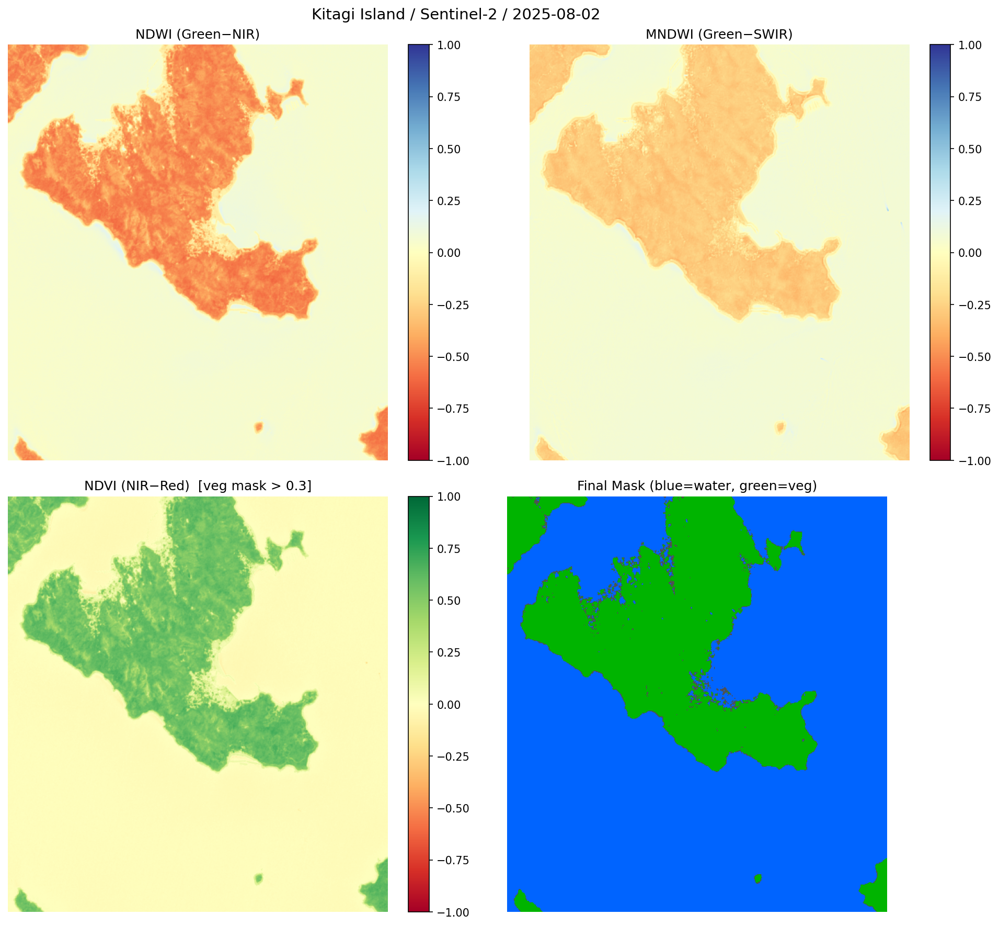
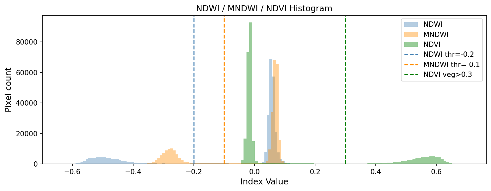
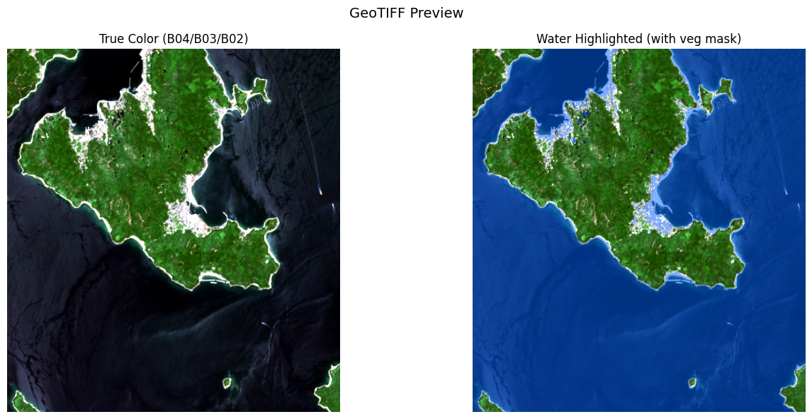

# 衛星リモートセンシングによる北木島丁場跡水域の検出と空間分布の把握

## 1. はじめに

### 1.1 背景

岡山県笠岡市に属する北木島は、笠岡諸島最大の島であり、花崗岩（北木石）の産地として知られる。北木石の採石は元和6年（1620年）の大坂城再築に遡り、明治期以降は産業として本格化した。昭和32年（1957年）には島内に大小127か所の丁場（採石場）が稼働し、人口は6,000〜12,000人に達した。しかし、安価な輸入石材との競争により採石業は衰退し、現在稼働する丁場はわずか2か所、島の人口は約600〜700人にまで減少している。

閉鎖後の丁場跡は、切り立った花崗岩の岩壁に囲まれた凹地に雨水や湧水が溜まり、深さ数m〜20m程度の池状の水域を形成している。これらの丁場跡水域は、「北木の桂林」と呼ばれる景観資源や湖上イベント会場として活用される例がある一方、その全容を網羅的に把握した調査は限られている。丁場跡の空間分布を体系的に記録することは、産業遺産の保全、観光資源の活用、安全管理の各観点から重要である。

2019年（令和元年）には「知ってる!? 悠久の時が流れる石の島」として瀬戸内備讃諸島の石文化が日本遺産に認定され、北木島の丁場、石切唄、石工用具等が構成文化財に登録された。この文脈においても、丁場跡の網羅的な位置把握は基礎資料として意義がある。

### 1.2 研究目的

本研究は、Sentinel-2衛星画像の水域指数を用いて北木島内の丁場跡水域を検出し、その空間分布を把握することを目的とする。具体的には、NDWI（Normalized Difference Water Index）とMNDWI（Modified NDWI）の2種の水域指数を併用し、花崗岩の岩肌と水域の分離を試みる。検出結果はインタラクティブ地図およびGeoTIFFとして出力し、現地調査や後続分析の基礎資料とする。

### 1.3 仮説

本研究では以下の3つの仮説を設定する。

- **仮説1**: 丁場跡の水域はNDWIおよびMNDWIにより衛星画像から検出可能である
- **仮説2**: 島内部に複数の独立した水域が検出され、歴史的に知られる丁場の分布と空間的に対応する
- **仮説3**: 夏季画像はNDVIによる植生マスクとの併用により、冬季・春季画像よりも水域の検出精度が向上する

## 2. 先行研究と本研究の位置づけ

### 2.1 水域指数に関する先行研究

McFeeters（1996）は、可視光Green帯と近赤外NIR帯の正規化差分比として NDWI = (Green − NIR) / (Green + NIR) を提唱した。NDWIは水域で正の値、植生・土壌で負の値を示し、開水面の検出に広く用いられている。しかし、裸地や建造物がNIR帯で低反射を示す場合、水域との誤分類が生じることが知られている。

Xu（2006）はこの問題に対し、NIRをSWIR（短波長赤外）に置き換えた MNDWI = (Green − SWIR) / (Green + SWIR) を提案した。SWIRは水による吸収がNIRよりはるかに強く、一方で裸地・岩肌はSWIRで比較的高い反射率を示す。このコントラストの差により、MNDWIは裸地と水域の分離能力がNDWIよりも優れることが示されている。

### 2.2 採石場跡の水域検出に関する研究

採石場跡の水域は一般に面積が小さく（数百m²〜数ha）、急峻な岩壁に囲まれている。Sentinel-2の空間分解能（10m）では、幅10m未満の水域はピクセル内で周囲の岩肌と混合し、水域指数の値が低下するスペクトル混合問題が生じる。Du et al.（2016）は、複数の水域指数を組み合わせることで、単一指数では検出困難な小規模水域の検出率を向上できることを示している。

### 2.3 本研究の位置づけ

本研究は、NDWIとMNDWIの和集合による複合判定に加え、NDVI植生マスクを組み合わせることで、花崗岩の岩肌が卓越する北木島において丁場跡水域の検出精度向上を試みるものである。また、3月（春季）と8月（夏季）の2時期の画像を比較し、季節による検出特性の違いを定量的に評価する点に独自性がある。

## 3. 研究方法

### 3.1 対象地域

| 項目 | 値 |
|------|-----|
| 島名 | 北木島（きたぎしま） |
| 所在 | 岡山県笠岡市 |
| 中心座標 | 34.374°N, 133.543°E |
| バウンディングボックス | W=133.515, S=34.350, E=133.570, N=34.400 |
| 地質 | 白亜紀後期の黒雲母花崗岩（北木石） |

### 3.2 データ取得

衛星画像データはMicrosoft Planetary ComputerのSTAC APIを通じて取得したSentinel-2 L2A（大気補正済み）プロダクトを使用した。

| 項目 | 春季画像 | 夏季画像 |
|------|---------|---------|
| シーンID | S2C_MSIL2A_20250323T014711 | S2A_MSIL2A_20250802T015121 |
| 撮影日 | 2025-03-23 | 2025-08-02 |
| 雲量 | 0.0% | 0.7% |
| タイル | T53SLU | T53SLU |
| 座標系 | EPSG:32653 (UTM Zone 53N) | EPSG:32653 (UTM Zone 53N) |

使用バンドは以下のとおりである。

| バンド | 波長 | 分解能 | 用途 |
|--------|------|--------|------|
| B02 (Blue) | 490nm | 10m | トゥルーカラー合成 |
| B03 (Green) | 560nm | 10m | NDWI・MNDWI計算 |
| B04 (Red) | 665nm | 10m | NDVI計算・トゥルーカラー合成 |
| B08 (NIR) | 842nm | 10m | NDWI・NDVI計算 |
| B11 (SWIR) | 1610nm | 20m | MNDWI計算 |

B11（20m分解能）はバイリニア補間により10m分解能にリサンプリングした。

### 3.3 分析指標

3種の正規化差分指数を計算した。

| 指数 | 式 | 意味 |
|------|-----|------|
| NDWI | (Green − NIR) / (Green + NIR) | 水域で正、植生で負 |
| MNDWI | (Green − SWIR) / (Green + SWIR) | 裸地・岩肌と水域の分離に優れる |
| NDVI | (NIR − Red) / (NIR + Red) | 植生で高値、水域で低値 |

### 3.4 分析手順

水域判定は以下の複合条件で行った。

```
水域マスク = (NDWI > -0.2  OR  MNDWI > -0.1)  AND  NOT (NDVI > 0.3)
```

NDWIとMNDWIの和集合により検出感度を確保しつつ、NDVI植生マスクにより植生の誤検出を排除する。閾値は負の値に設定し、スペクトル混合によりNDWI/MNDWI値が低下する小規模水域の検出を試みた。水域ポリゴンは100m²以上のもののみを抽出した。

Foliumインタラクティブ地図への重畳に際しては、UTM座標系（EPSG:32653）からWGS84（EPSG:4326）への再投影を行い、座標系変換に起因する位置ずれを解消した。

### 3.5 使用ソフトウェア

Python 3.11、pystac-client 0.9.0、planetary-computer 1.0.0、rasterio 1.4.4、numpy 2.4.3、shapely 2.1.2、folium 0.20.0。パッケージ管理にはuvを使用した。

## 4. 結果

### 4.1 春季画像（2025年3月23日）による検出

表4-1に春季画像の検出結果を示す。

**表4-1 春季画像の指数値域と検出結果**

| 指標 | 値 |
|------|-----|
| NDWI値域 | [−0.992, 1.000] |
| MNDWI値域 | [−0.988, 0.615] |
| 水域候補 (NDWI > −0.2 \| MNDWI > −0.1) | 215,984 px |
| 抽出ポリゴン数（100m²以上） | 114 |
| 島内水域ポリゴン数（海域除外） | 113 |
| 島内最大水域面積 | 1.28 ha |
| 1,000m²超の島内水域数 | 22 |

春季画像ではNDWI最大値が1.000に達し、海域の検出は明瞭であった。島内では113の水域ポリゴンが検出され、最大のものは島北西部（34.392°N, 133.538°E）の1.28haであった。

### 4.2 夏季画像（2025年8月2日）による検出

表4-2に夏季画像の検出結果を示す。

**表4-2 夏季画像の指数値域と検出結果**

| 指標 | 値 |
|------|-----|
| NDWI値域 | [−0.632, 0.210] |
| MNDWI値域 | [−0.434, 0.438] |
| NDVI値域 | [−0.231, 0.698] |
| 水域候補 (NDWI超 \| MNDWI超) | 212,803 px |
| 植生マスク (NDVI > 0.3) | 72,636 px |
| 最終水域マスク (候補 & ~植生) | 212,794 px |
| 植生マスクにより除外 | 9 px |
| 抽出ポリゴン数（100m²以上） | 146 |
| 島内水域ポリゴン数（海域除外） | 145 |
| 島内最大水域面積 | 7,826 m² |
| 1,000m²超の島内水域数 | 14 |

夏季画像ではNDWI最大値が0.210、MNDWI最大値が0.438にとどまり、春季画像と比較して指数値域が大幅に狭かった。一方、NDVI最大値は0.698に達し、島内の植生域が明確に分離された。植生マスクで除外されたピクセルはわずか9であり、水域候補と植生域の重複は極めて小さかった。

図4-1に夏季画像の水域指数・植生指数の空間分布を示す。左上のNDWIでは海域が薄い青色、島内は全体的に赤〜橙色で負の値を示す。右上のMNDWIはNDWIと類似した空間パターンを示すが、島内の濃淡が異なる。左下のNDVIでは島内の植生域が緑色で明瞭に描画され、海域は黄〜赤色となっている。右下の最終マスクでは、水域（青）・植生（緑）・その他（灰）の3分類が可視化されており、島の輪郭が鮮明に識別できる。



図4-2にNDWI・MNDWI・NDVIのヒストグラムを示す。NDWIの分布は−0.6〜0.2の範囲に広がり、陸域ピーク（−0.5付近）と海域ピーク（0.05〜0.15付近）が認められる。MNDWIはNDWIより値域が狭く、−0.3〜0.2に集中している。NDVIは0.0付近に大きなピーク（海域・裸地）を持ち、0.5〜0.7にサブピーク（植生）が認められる。NDVI閾値0.3は、この2つのピーク間の谷に位置しており、植生と非植生の分離に適切であることがわかる。



### 4.3 島内水域の空間分布

夏季画像から検出された主要な島内水域を表4-3に示す。

**表4-3 島内主要水域（夏季画像、上位10件）**

| 順位 | 面積 | 緯度 | 経度 | 島内位置 |
|------|------|------|------|---------|
| 1 | 7,826 m² | 34.3911°N | 133.5333°E | 北部 |
| 2 | 6,521 m² | 34.3781°N | 133.5421°E | 南東部 |
| 3 | 4,715 m² | 34.3922°N | 133.5384°E | 北部 |
| 4 | 4,715 m² | 34.3875°N | 133.5313°E | 中央部 |
| 5 | 4,013 m² | 34.3933°N | 133.5376°E | 北部 |
| 6 | 4,013 m² | 34.3901°N | 133.5321°E | 中北部 |
| 7 | 3,110 m² | 34.3762°N | 133.5416°E | 南東部 |
| 8 | 2,508 m² | 34.3905°N | 133.5216°E | 西部 |
| 9 | 2,007 m² | 34.3925°N | 133.5370°E | 北部 |
| 10 | 1,806 m² | 34.3908°N | 133.5383°E | 北部 |

空間分布を概観すると、以下の4つの集中地帯が認められる。

1. **島北部（34.391〜393°N, 133.533〜538°E）**: 上位10件中6件が集中。最大水域（7,826m²）を含む。複数の丁場が近接して操業していた地区と推定される
2. **島南東部（34.376〜378°N, 133.542°E）**: 2番目に大きい水域（6,521m²）を含む2件が分布
3. **島中央部（34.387〜390°N, 133.531〜533°E）**: 中規模水域が散在
4. **島西部（34.386〜391°N, 133.522〜528°E）**: 小〜中規模水域が点在

### 4.4 春季・夏季画像の比較

表4-4に両時期の主要指標の比較を示す。

**表4-4 春季・夏季画像の比較**

| 指標 | 春季（3月） | 夏季（8月） |
|------|-----------|-----------|
| NDWI最大値 | 1.000 | 0.210 |
| MNDWI最大値 | 0.615 | 0.438 |
| 島内ポリゴン数 | 113 | 145 |
| 島内最大水域 | 1.28 ha | 0.78 ha |
| 1,000m²超水域数 | 22 | 14 |
| ポリゴン面積中央値 | 399 m² | 201 m² |

春季画像は水域指数の値域が広く大型水域の検出に優れる一方、夏季画像はポリゴン総数が多く小規模水域の検出に優れる傾向を示した。

### 4.5 水域強調衛星画像

図4-3に夏季画像のトゥルーカラー合成（左）と水域強調画像（右）を示す。トゥルーカラー画像では島の植生が緑色に描画され、島形状が鮮明に確認できる。水域強調画像では、複合水域マスクに該当するピクセルが青色でブレンド表示されており、海域に加えて島内部の丁場跡水域が青色スポットとして視認できる。



## 5. 考察

### 5.1 仮説の検証

**仮説1「丁場跡の水域はNDWIおよびMNDWIにより検出可能である」** — **支持される**。春季・夏季いずれの画像においても、島内に100件以上の水域ポリゴンが検出された。単一指数では検出困難な小規模水域も、NDWIとMNDWIの和集合による複合判定で捕捉できた。ただし、Sentinel-2の10m分解能ではスペクトル混合により水域指数値が低下するため、閾値を負の値（NDWI > −0.2, MNDWI > −0.1）に設定する必要があった。

**仮説2「島内部に複数の独立した水域が検出され、丁場の分布と空間的に対応する」** — **部分的に支持される**。145件の島内水域が検出され、北部・南東部・中央部・西部の4つの集中地帯が認められた。歴史的記録によれば昭和32年に127か所の丁場が存在したとされ、検出水域数（145件）はこれに近い規模である。ただし、本研究では検出水域と既知の丁場位置との個別照合は行っておらず、海岸線付近の非丁場水域や影による誤検出が含まれる可能性がある。

**仮説3「夏季画像はNDVI植生マスクとの併用で検出精度が向上する」** — **棄却される**。NDVI植生マスクで除外されたピクセルはわずか9であり、実質的な効果は認められなかった。これは、水域候補（NDWI超 OR MNDWI超）の領域と高NDVI植生域がほとんど重複しないことによる。北木島の植生は水域指数の閾値を超えるほどの水域的反射特性を示さないため、NDVIマスクの追加的効果は限定的であった。

### 5.2 夏季画像と春季画像の特性の違い

夏季画像でNDWI最大値が0.210にとどまった点は注目に値する。春季画像のNDWI最大値1.000との差は、以下の要因が考えられる。

1. **大気の影響**: 夏季は水蒸気量が多く、NIR帯の大気透過率が低下する
2. **海水の特性変化**: 夏季の海水温上昇や懸濁物質の増加により、海域のNDWI値が低下する
3. **太陽高度角**: 8月の太陽高度角は3月より高く、水面でのフレネル反射率が異なる

一方、夏季画像はNDVIパネルで島の輪郭が鮮明に描画され、植生域と非植生域（岩肌・水域）の空間的分離が容易であった。この特性は、目視による丁場跡の確認作業を補助する点で有用である。

### 5.3 検出水域と歴史的丁場分布の対応

島北部に水域が集中する傾向は、北木島の採石が主に島の北側で行われていた歴史的記録と整合する。特に金風呂地区（小金風呂）は明治25年に鶴田丁場が開かれた地域であり、現在も鶴田石材が操業を継続している。島北部の水域集中はこの採石中心地に対応すると考えられる。

南東部に検出された大型水域（6,521m²）は、旧今岡石材の丁場跡「北木の桂林」に相当する可能性がある。同地は島内最大規模の丁場であり、水深約20mのエメラルドグリーンの湖が形成されていることが知られている。

### 5.4 分析の限界

1. **空間分解能の制約**: Sentinel-2の10m分解能では、幅10m未満の丁場跡水域は検出困難である。実際の丁場跡水域のうち、面積100m²未満のものは本分析では捕捉されていない
2. **海域との分離**: 海岸線付近の水域ポリゴンには海域が含まれている可能性があり、陸域マスクによる厳密な分離は行っていない
3. **閾値の妥当性**: 負の閾値（NDWI > −0.2）の設定は検出感度を高める一方、暗い岩肌や影の誤検出リスクを伴う。最適閾値の決定には現地検証データが必要である
4. **季節変動**: 2時期の比較のみであり、降水量による水位変動や経年変化は考慮していない
5. **丁場跡の同定**: 検出水域が丁場跡であるか否かの判定は行っておらず、自然の池沼や人工ため池が含まれる可能性がある

## 6. 結論

### 6.1 主要な知見

本研究では、Sentinel-2衛星画像のNDWIとMNDWIを併用した複合判定により、北木島内の水域を検出し、以下の知見を得た。

1. NDWIとMNDWIの和集合により、春季画像で113件、夏季画像で145件の島内水域ポリゴン（100m²以上）を検出した
2. 検出水域は島北部・南東部・中央部・西部の4つの集中地帯に分布し、歴史的な採石中心地と空間的に整合する傾向が認められた
3. 夏季画像はポリゴン総数で春季画像を上回ったが、NDVI植生マスクの追加効果は限定的であった
4. 閾値を負の値に設定することで、スペクトル混合が生じる小規模水域の検出感度を確保できた

### 6.2 学術的貢献

本研究は、花崗岩採石場跡の水域検出に特化したリモートセンシング手法の適用事例として、以下の点で貢献する。

- NDWIとMNDWIの併用が花崗岩卓越環境での水域検出に有効であることを実証した
- 春季・夏季の2時期比較により、季節による検出特性の違いを定量的に示した
- 検出結果をインタラクティブ地図・GeoTIFF・GeoJSONとして出力し、後続の現地調査やGIS分析の基礎資料を整備した

### 6.3 今後の課題

1. **陸域マスクの導入**: 海岸線ポリゴンを用いて島内部の水域のみを厳密に抽出する
2. **現地検証**: 検出水域と実際の丁場跡の照合による精度評価（適合率・再現率の算出）
3. **マルチテンポラル分析**: 複数年・複数季節の画像を用いた経年変化分析
4. **高分解能画像の活用**: Sentinel-2（10m）よりも高分解能の画像（例: Planet 3m, WorldView 0.3m）による小規模水域の検出
5. **他地域への適用**: 白石島・犬島等、瀬戸内海の他の採石島への手法展開

## 参考文献

### 学術文献

- Du, Y., Zhang, Y., Ling, F., Wang, Q., Li, W. and Li, X. (2016) Water bodies' mapping from Sentinel-2 imagery with Modified Normalized Difference Water Index at 10-m spatial resolution produced by sharpening the SWIR band. *Remote Sensing*, **8**(4), 354. — 複数水域指数の組み合わせによる小規模水域検出の先行研究
- McFeeters, S. K. (1996) The use of the Normalized Difference Water Index (NDWI) in the delineation of open water features. *International Journal of Remote Sensing*, **17**(7), 1425-1432. — NDWI の提唱論文
- Xu, H. (2006) Modification of normalised difference water index (NDWI) to enhance open water features in remotely sensed imagery. *International Journal of Remote Sensing*, **27**(14), 3025-3033. — MNDWI の提唱論文。裸地・建造物と水域の分離改善

### プロジェクト内参照

- `docs/plans/exp002_kitagi_quarry_water_detection.md` — 実験計画書
- `notebooks/exp002_kitagi_quarry_water_detection.ipynb` — 分析ノートブック
- `docs/experiments/exp002_kitagi_quarry_water_detection.md` — ノートブック対応ドキュメント
- `tmp/exp002_kitagi_water_map.html` — インタラクティブ地図
- `tmp/exp002_kitagi_water_bodies.geojson` — 水域ポリゴンGeoJSON
- `tmp/exp002_kitagi_ndwi.tif` — 水域指数GeoTIFF（NDWI/MNDWI/NDVI/WaterScore 4バンド）
- `tmp/exp002_kitagi_water_highlighted.tif` — 水域強調衛星画像GeoTIFF
